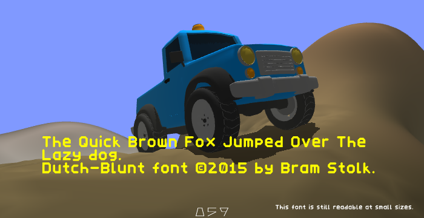

# dutch-blunt
Low poly font (plus rendering system.)
Uses triangles not textures, for always sharp edges.

## The Font
Dutch-Blunt is both the name of the minimalistic font that I created, and its rendering API.
The font was created with the following criteria:

* Rendered as pure triangles as opposed to curves, textures, or lines.
* Low polygon (triangle) count for each glyph.
* ASCII only (characters 33 to 127 inclusive.)

## The API
The font was created in Wings3D and exported to Wavefront OBJ.
Dutch-Blunt comes with a python script that will read the wavefront OBJ file and create C-source code.
The glyph data containst glyph widths, the triangle vertices, the vertex count, and an offset into a global vertex data set.

A C interface is provided to convert an ASCII string into triangle vertices that can be fed into e.g. OpenGL.

	/*!
	 * Convert an ascii string to a stream of vertex data.
	 * Returns the number of triangles(x,y,x,y,x,y) written to the buffer.
	 */
	int dblunt_string_to_vertices
	(
	        const char* str,                //!< characters to render.
	        float* destbuf,                 //!< output buffer to hold vertices.
	        int destbufsz,                  //!< size of output buffer in bytes.
	        float posx, float posy,         //!< target position for text render.
	        float sclx, float scly,         //!< scale of the text render.
	        int* textw,                     //!< out: width of longest line.
	        int* texth                      //!< out: height of text.
	);

## The License
The Dutch-Blunt font, and its supporting software is (c)2015 by Abraham Stolk.

The font 'Dutch-Blunt' is licensed under the 
[SIL OPEN FONT LICENSE.](http://opensource.org/licenses/OFL-1.1)

The API and conversion script is licensed under the 
[Apache License 2.0](http://opensource.org/licenses/Apache-2.0)

